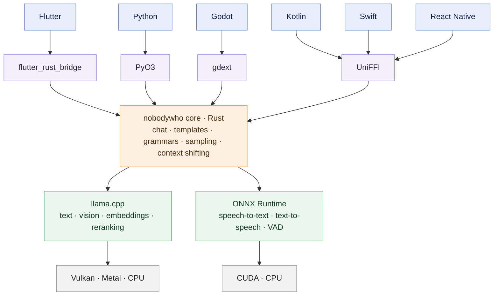

[](https://discord.gg/qhaMc2qCYB)
[](https://matrix.to/#/#nobodywho:matrix.org)
[](https://mastodon.gamedev.place/@nobodywho)
[](https://pub.dev/packages/nobodywho)
[](https://pypi.org/project/nobodywho/)
[](https://www.npmjs.com/package/react-native-nobodywho)
[](https://godotengine.org/asset-library/asset/2886)
[](CODE_OF_CONDUCT.md)
[](https://docs.nobodywho.ooo)

<p align="center">
  
</p>

<p align="center">
  <strong> On-device AI for any device.</strong><br/>
  NobodyWho is an inference engine that lets you run LLMs locally and efficiently.
</p>

---

## ✨ Features

* **Run locally, offline** — no API keys needed or hidden fees
* **Run any chat LLM** — Gemma, Qwen, Mistral and more
* **Fast, type-safe tool calling** — automatically generates structured grammars from your function signatures
* **Multimodal input** — provide image and audio information to your LLM
* **Text-to-speech** — synthesize local WAV audio with Kokoro, Pocket TTS and Supertonic backends
* **Speech-to-text** — transcribe audio into text with Whisper
* **Voice Activity Detection** — know when to stop listening and start transcribing with Silero
* **Model downloading** — load models directly from [Hugging Face](https://huggingface.co/models?library=gguf&sort=trending) or any URL

## ⚡️ Under the Hood

* GPU-accelerated inference via Vulkan or Metal — runs fast on any OS
* Conversation-aware preemptive context shifting — retain full conversation memory without any message length limits
* Compatible with thousands of pre-trained LLMs — use any LLM in the GGUF format
* Powered by the wonderful [llama.cpp](https://github.com/ggml-org/llama.cpp)

You can test our inference engine on [iOS](https://apps.apple.com/us/app/nobodywho-chat/id6781001350), [Android](https://play.google.com/store/apps/details?id=ai.nobodywho.mobile), [Vision Pro](https://example.com/nobodywho-eyes) and [Apple Watch](https://example.com/nobodywho-wrist).

---

## Platforms

| Binding | Install | Runs on | Documentation |
|---------|---------|---------|---------------|
| **Kotlin** | [Maven Central](#quick-start) | Desktop, Android | [docs.nobodywho.ooo/kotlin](https://docs.nobodywho.ooo/kotlin/) |
| **Swift** | [SPM](#quick-start) | Desktop, iOS, visionOS, watchOS | [docs.nobodywho.ooo/swift](https://docs.nobodywho.ooo/swift/) |
| **React Native / Expo** | [npm](#quick-start) | Desktop, Android, iOS | [docs.nobodywho.ooo/react-native](https://docs.nobodywho.ooo/react-native/) |
| **Flutter** | [pub.dev](#quick-start) | Desktop, Android, iOS | [docs.nobodywho.ooo/flutter](https://docs.nobodywho.ooo/flutter/) |
| **Python** | [PyPI](#quick-start) | Desktop | [docs.nobodywho.ooo/python](https://docs.nobodywho.ooo/python/) |
| **Godot** | [AssetLib](#quick-start) | Desktop, Android | [docs.nobodywho.ooo/godot](https://docs.nobodywho.ooo/godot/) |

Desktop means Linux, macOS and Windows throughout. Three gaps worth knowing before you start:

- **Godot has no iOS export.** Use the Flutter, React Native or Swift binding on iOS.
- **Windows ARM64** is not supported yet.
- **There is no web export.** It is tracked in [issue #111](https://github.com/nobodywho-ooo/nobodywho/issues/111).

⭐ Useful to you? Star the repo, it's the easiest way to say thanks.

## Requirements

Inference uses Vulkan or Metal where available and CPU where not. The real constraint is memory.

### Desktop

- **Hardware** — any 64-bit Linux, macOS or Windows machine. Windows is x86_64 only, there are no
  ARM64 Windows builds. macOS accelerates through Metal out of the box, Linux and Windows need a
  GPU driver with Vulkan support and fall back to CPU without one.
- **Memory** — roughly 1.5× the model file in free RAM, or 2× on a machine that's already busy.
  8 GB is a comfortable floor for models up to ~2 GB; 16 GB or more above that.
- **Discrete GPUs** — NobodyWho offloads as many layers as fit in free VRAM and runs the rest on
  the CPU, so a model larger than your VRAM still works, just slower. If barely any of it fits, it
  skips the GPU and stays on CPU. It uses one GPU, the card with the most free memory.

### Mobile

- **iOS** — iPhone 11 or newer, 4 GB RAM or more.
- **Android** — Snapdragon 855 / Adreno 640 / 6 GB RAM or better.
- **Rule of thumb** — the device needs roughly twice the model file size in *available* RAM. iOS
  reserves around 2 GB, Android 2 to 4 GB depending on vendor. Models under 1 GB run smoothly on
  any mobile.

## Models

Any model in the [GGUF format](https://huggingface.co/models?library=gguf&sort=trending) works. Pass a `hf:owner/repo:QUANT` reference, an HTTPS URL, or a local path anywhere a model path is expected; remote models are downloaded and cached on first use. Pass `"auto"` to fit one to available memory.

Start with [Qwen3 0.6B](https://huggingface.co/NobodyWho/Qwen_Qwen3-0.6B-GGUF): at ~330 MB it is
small enough for any phone and good enough to tell whether the integration works.

---

## Quick Start

<details>
<summary><b>Kotlin</b></summary>

```kotlin
// Android
implementation("ai.nobodywho:nobodywho-android:<version>")

// Desktop JVM (Linux, macOS, Windows)
implementation("ai.nobodywho:nobodywho:<version>")
```

Use the version from the [Maven Central badge](https://central.sonatype.com/artifact/ai.nobodywho/nobodywho) above.

```kotlin
import ai.nobodywho.Chat

val chat = Chat.fromPath(
    modelPath = "hf:NobodyWho/Qwen_Qwen3-0.6B-GGUF:Q4_K_M"
)

val response = chat.ask("What is the capital of Denmark?").completed()
println(response) // The capital of Denmark is Copenhagen.
```

[Kotlin documentation](https://docs.nobodywho.ooo/kotlin/)

</details>

<details>
<summary><b>Swift</b></summary>

Add via Swift Package Manager:

```text
https://github.com/nobodywho-ooo/nobodywho-swift.git
```

```swift
import NobodyWho

let chat = try await Chat.fromPath(
    modelPath: "hf:NobodyWho/Qwen_Qwen3-0.6B-GGUF:Q4_K_M"
)

let response = try await chat.ask("What is the capital of Denmark?").completed()
print(response) // The capital of Denmark is Copenhagen.
```

[Swift documentation](https://docs.nobodywho.ooo/swift/) · [GitHub](https://github.com/nobodywho-ooo/nobodywho-swift) · [starter app](https://github.com/nobodywho-ooo/swift-starter-example)

</details>

<details>
<summary><b>React Native / Expo</b></summary>

```bash
# React Native
npm install react-native-nobodywho

# Expo
npx expo install react-native-nobodywho
```

```typescript
import { Chat } from "react-native-nobodywho";

const chat = await Chat.fromPath({
  modelPath: "hf:NobodyWho/Qwen_Qwen3-0.6B-GGUF:Q4_K_M",
});

const msg = await chat.ask("What is the capital of Denmark?").completed();
console.log(msg); // The capital of Denmark is Copenhagen.
```

[RN / Expo documentation](https://docs.nobodywho.ooo/react-native/) · [NPM](https://www.npmjs.com/package/react-native-nobodywho) · [RN starter app](https://github.com/nobodywho-ooo/react-native-starter-example) · [Expo starter app](https://github.com/nobodywho-ooo/expo-starter-example)

</details>

<details>
<summary><b>Flutter</b></summary>

```bash
flutter pub add nobodywho
```

```dart
import 'package:nobodywho/nobodywho.dart' as nobodywho;

void main() async {
  await nobodywho.NobodyWho.init();

  final chat = await nobodywho.Chat.fromPath(
    modelPath: 'hf:NobodyWho/Qwen_Qwen3-0.6B-GGUF:Q4_K_M',
  );

  final msg = await chat.ask('What is the capital of Denmark?').completed();
  print(msg); // The capital of Denmark is Copenhagen.
}
```

[Flutter documentation](https://docs.nobodywho.ooo/flutter/) · [pub.dev](https://pub.dev/packages/nobodywho) · [starter app](https://github.com/nobodywho-ooo/flutter-starter-example)

</details>

<details>
<summary><b>Python</b></summary>

```bash
pip install nobodywho
```

```python
from nobodywho import Chat

chat = Chat('hf:NobodyWho/Qwen_Qwen3-0.6B-GGUF:Q4_K_M')
response = chat.ask('Is water wet?')
print(response.completed()) // The capital of Denmark is Copenhagen.
```

[Python documentation](https://docs.nobodywho.ooo/python/) · [PyPI](https://pypi.org/project/nobodywho/)

</details>

<details>
<summary><b>Godot</b></summary>

There is no terminal command for Godot — install it from inside the editor:

1. In Godot 4.5+, open the **AssetLib** tab and search for **NobodyWho**.
2. Download and import it, making sure **Ignore asset root** is ticked in the import dialogue.
3. Reload the project.

You can also grab a specific version from the [releases page](https://github.com/nobodywho-ooo/nobodywho/releases) and import the zip the same way.

[Godot documentation](https://docs.nobodywho.ooo/godot/install/)

</details>

<details>
<summary><b>Local Server</b></summary>

NobodyWho provides an experimental local server that implements the OpenAI Chat Completions API.

Start the server :

```bash
uvx --from 'git+https://github.com/nobodywho-ooo/nobodywho.git#subdirectory=nobodywho/server' nobodywho-server --model hf:NobodyWho/Qwen_Qwen3-0.6B-GGUF:Q4_K_M --name qwen
```

It listens on `http://127.0.0.1:8888` and serves `/v1/models` and `/v1/chat/completions`. 
See the [docs](https://docs.nobodywho.ooo/docs/server) for more info.
</details>

---

## Under the hood



One Rust core does the work; each binding is a thin, idiomatic surface over it. That is why a
feature lands everywhere at once, and why behaviour doesn't drift between platforms.

---

## Documentation

The documentation has everything you might want to know: https://docs.nobodywho.ooo/

Working with a coding agent? Point it at [llms.txt](https://docs.nobodywho.ooo/llms.txt) or
[llms-full.txt](https://docs.nobodywho.ooo/llms-full.txt), or install the NobodyWho skill so your agent can look up the current APIs and documentation:

`npx skills add https://github.com/nobodywho-ooo/nobodywho --skill nobodywho`

## Community

- [Discord](https://discord.gg/qhaMc2qCYB) & [Matrix](https://matrix.to/#/#nobodywho:matrix.org) — ask us anything
- [Issues](https://github.com/nobodywho-ooo/nobodywho/issues) and [Discussions](https://github.com/nobodywho-ooo/nobodywho/discussions) — bugs and feature requests
- [CONTRIBUTING.md](CONTRIBUTING.md) — set up the repo and send a PR
- [CHANGELOG.md](CHANGELOG.md) · [SECURITY.md](SECURITY.md) · [CODE_OF_CONDUCT.md](CODE_OF_CONDUCT.md)

⭐ **Star the repo** if NobodyWho is useful to you. It is how people find us.

## License

NobodyWho is licensed under the [EUPL-1.2](LICENSE). **You may use it in proprietary and commercial
projects, free of charge.** There has been some confusion about this, so to be precise:

> Linking two programs or linking an existing software with your own work does not – at least under European law – produce a derivative or extend the coverage of the linked software licence to your own work. [[1]](https://interoperable-europe.ec.europa.eu/collection/eupl/licence-compatibility-permissivity-reciprocity-and-interoperability)

If you distribute modified versions of the code *in this repo*, you must open source those changes.
Make proprietary projects using NobodyWho; just don't make a proprietary fork of NobodyWho.
